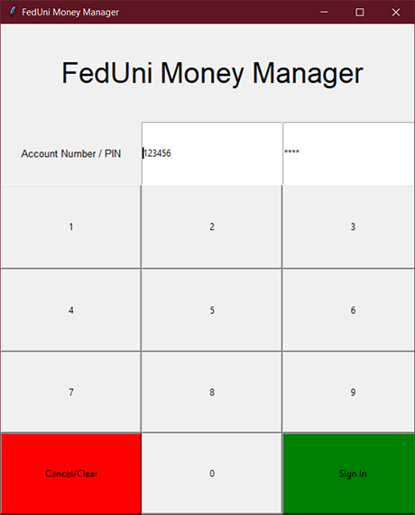
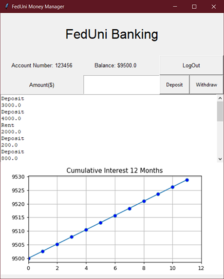

# FedUni Banking
## A Python Tkinter Application

This is a Money Manager Application, which has a functionality of login **Account Number** and **password**.

After Logging in we have a window displaying the *Account_number*, *Current Balance*, and all others are visible in the image given below.

