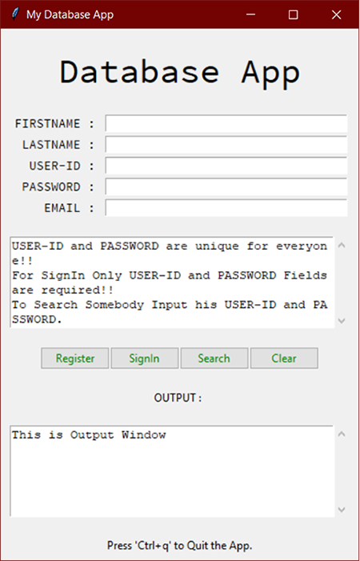
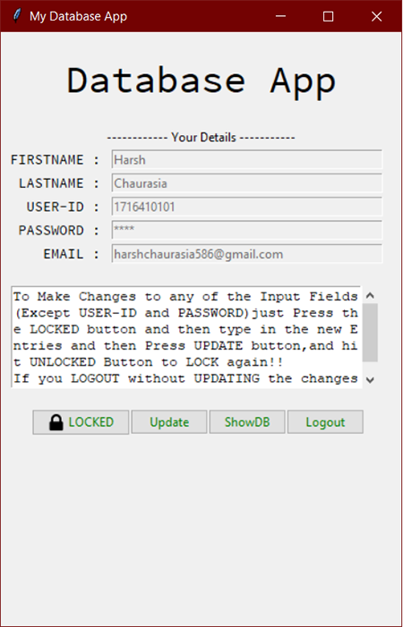

# MyDatabase App
This is a Tkinter Python Application that Uses sqlite3 as Database to store Information Provided by the User.

## Modules :
### 1. Preview :
With this Module you can preview the details of any user with entering his **User-Id** and **Password**.

### 2. Register :
With this Module you can register new users to the Database, just by providing his **Firstname**, **Lastnmae**, **User-Id**, **Password**, **email**.
**Note :** *User-Id* and *Password* is **Unique** for every user in the Database. 

### 3. SignIn :
With this Module you can Login to the Individual Users Account, just by entering his **User-Id** and **Password**.From where you'll be able to Update, Delete his/her details/Account from the Database.

### 4. Search :
With this Module You can Search for any User that is present in the Database.

## Modules :
### 1. Update :
With this Module you can easily update you **User_FirstName**, **User_LastName** or **User_Email** by clicking on the **LOCKED** Button and Entering the Password For the User(For Verification) and Entering the Values You wish to Change and then *press the **UPDATE** Button*.

### 2. ShowDB :
With this Module you can view all the entries present in the Database.

### 3. Logout :
With this Module you can Logout of you Account and return back to the Main Screen of the App.

-------------------------------------------------------------------------------------------------------------------------------------------
**Thanks for Visiting my Repository**.
